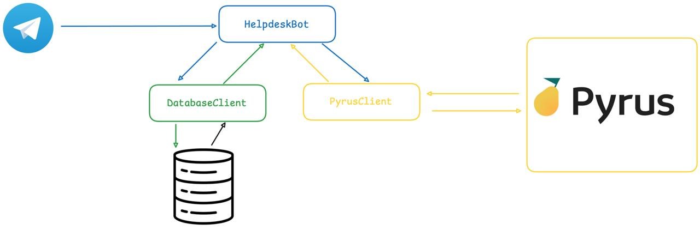

# Tech Support Helpdesk Automation with Telegram and Pyrus Integration

A fully asynchronous helpdesk automation tool built with Telethon for Telegram integration. It automates the logging and management of support conversations (tickets/issues) between clients and tech support operators via the Pyrus platform.

>💡 **What is Pyrus?**  
> **Pyrus** is a workflow & ticket management platform with a REST API.    
> API docs: https://pyrus.com/en/help/api

[](LICENSE)


# Demo 
Link to demo

## ✨ Features
- Tracks all incoming and outgoing Telegram messages and stores them in the database.
- Creates a new Pyrus ticket when an operator replies and no open ticket exists.
- Adds every subsequent message to the corresponding ticket on Pyrus.
- Closes the ticket when the operator uses a predefined code phrase (e.g., “Goodbye!”). 

## 🏗 Tech Stack
- Python 3.13.2
- Telethon
- httpx
- asyncpg
- python-dotenv
- colorama

## 🔧 Architecture Overview


The project has three main modules:
- `HelpdeskBot` – Responsible for listening to Telegram messages via Telethon and calling DatabaseClient and PyrusClient.

- `DatabaseClient` – Responsible for executing SQL code in the database, creating tables, fetching data, saving data, etc.

- `PyrusClient` – Responsible for interacting with the Pyrus API. It can create new tickets, add messages, close tickets, etc.

## 🚀 Getting Started

### Prerequisites
- Postgres 14+

### Setup
```bash
git clone git@github.com:levs-brezgins/helpdesk-automation.git
cd helpdesk-automation
cp .env.sample .env   # set Telethon, Pyrus, PostgreSQL creds, and code phrase
# Create virtual enviroment 
python3 -m venv .helpdesk-venv
# Activate it 
source .helpdesk-venv/bin/activate
# Run 
pip install -r requirements.txt
```
### How to start?
```bash
# Run the script from the project root:
python3 app/main.py
```
